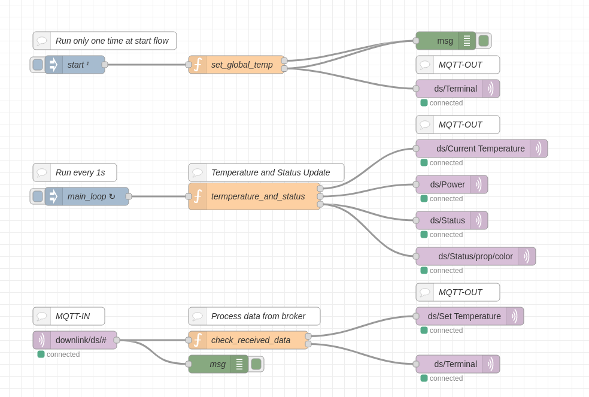

# Blynk MQTT Client for Node-RED

Node-RED is a visual programming tool that streamlines the integration of
devices, APIs, and online services. With its drag-and-drop interface, users can
easily create workflows by connecting predefined nodes to perform various tasks
without extensive coding. It's widely used in IoT, home automation, and
industrial automation applications for its flexibility, scalability, and ease
of use. Node-RED enables rapid development of IoT solutions, from simple data
collection to complex automation scenarios.

---

## Prepare Your Device in Blynk.Cloud

1. Create a Blynk template based on the provided blueprint. Click the **`Use Blueprint`** button in [`MQTT Air Cooler/Heater Demo`](https://blynk.cloud/dashboard/blueprints/Library/TMPL4zGiS1A7l).
2. In the left panel, select `Devices`.
3. Click the `New Device` button.
4. Select `From Template -> MQTT Demo`, and click **`Create`**.

> [!NOTE]
> Please make a note of the device credentials that appear in the upper right corner. You'll need them in the next step.

## Install Node-RED

Follow the instructions provided in the [official Node-RED documentation](https://nodered.org/docs/getting-started/local) to install Node-RED.

## Set Up Node-RED Flow

1. Import the file "flow.json" to Node-RED.
2. Open settings for the MQTT node and edit the server property: go to the
   Security tab and set your [Blynk device credentials](https://docs.blynk.io/en/getting-started/activating-devices/manual-device-activation#getting-auth-token)
   in the Password field, and "device" in Username field.

## Run the Sample Using Node-RED

Deploy the flow and go to blynk.cloud for testing.

---

## Further Reading

- [Setting up Blynk MQTT Client with Node-RED manually](https://docs.blynk.io/en/hardware-guides/node-red)
- [Blynk MQTT API Documentation](https://docs.blynk.io/en/blynk.cloud-mqtt-api/device-mqtt-api)
- [Blynk Troubleshooting Guide](https://docs.blynk.io/en/troubleshooting/general-issues)
- [Blynk Documentation](https://docs.blynk.io/en)

